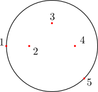

Definition of a fiber bundle
============================

A fiber bundle in *Phantomas* is defined as a cylindrical tube wrapped around
its centerline. The centerline itself is a continuous curve in 3D, and can be
simply created from a few control points. In this tutorial, we will show on a
simple example how to define a fiber bundle.

We first define a series of control points, through which the bundle centerline
will pass. Note that the first and the last control points should lie on the
"cortical surface". Here (and in the current release of *Phantomas*), the
cortical surface is a sphere. The radius of the sphere in the present example
is 10mm.

Note that in the example shown here, the points are in the :math:`z=0` plane,
while in general points are defined by their 3D Cartesian coordinates.

.. container:: clearer

    Control points can be defined in a JSON file. For instance, the example 
    illustrated here would look like:
    
    .. code-block:: javascript
    
        {
          'fiber_geometries' : {
            'planar_fiber': {
              'control_points': 
                [-10.0 ,  0.0 , 0.0,
                  -5.0 ,  0.0 , 0.0,
                   0.0 ,  5.0 , 0.0,
                   5.  ,  0.0 , 0.0,
                   7.07, -7.07, 0.0],
              'tangents': 'symmetric',
              'radius': 2.0
            },
          },
        }

.. container:: clearer

    .. image:: figures/control_points_2.png
         :align: left
    
    The tangent to the centerline at the cortical surface will necessarily be *normal*
    to the surface. This is automatically done by *Phantomas*.

.. container:: clearer

    .. image:: figures/control_points_3.png
         :align: left
    
    *Phantomas* will also compute the tangents to the fiber bundle centerline 
    for each control points provided. There are three modes to define these 
    tangents; we recommend the use of the default mode, ``"symmetric"``.

.. container:: clearer

    .. image:: figures/control_points_4.png
         :align: left

    Finally, the fiber centerline is constructed using piecewise polynomials.

.. container:: clearer

    To sum up, the only thing you need to provide to define a fiber is a set
    of control points, and the radius of the bundle.

